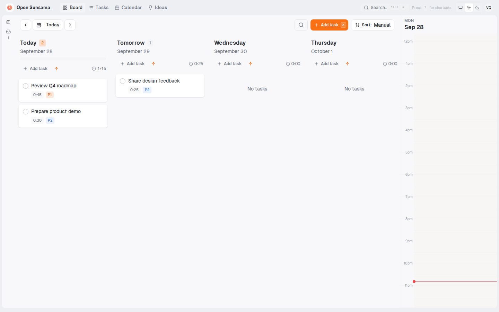
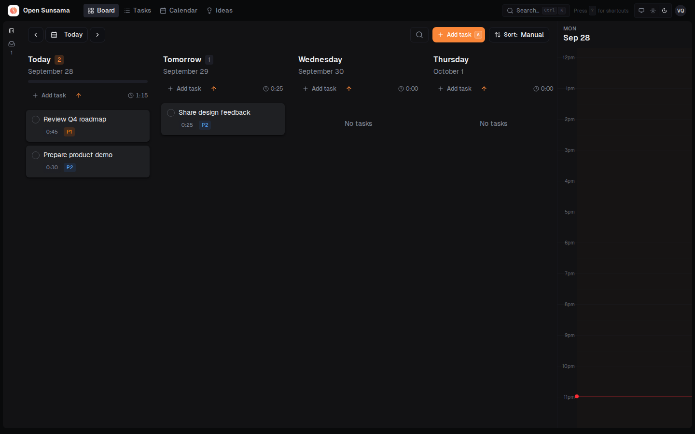
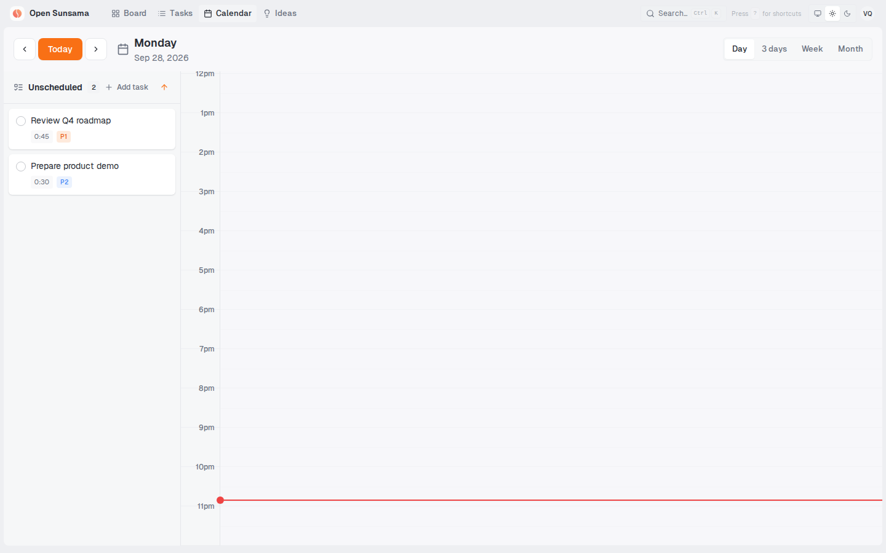
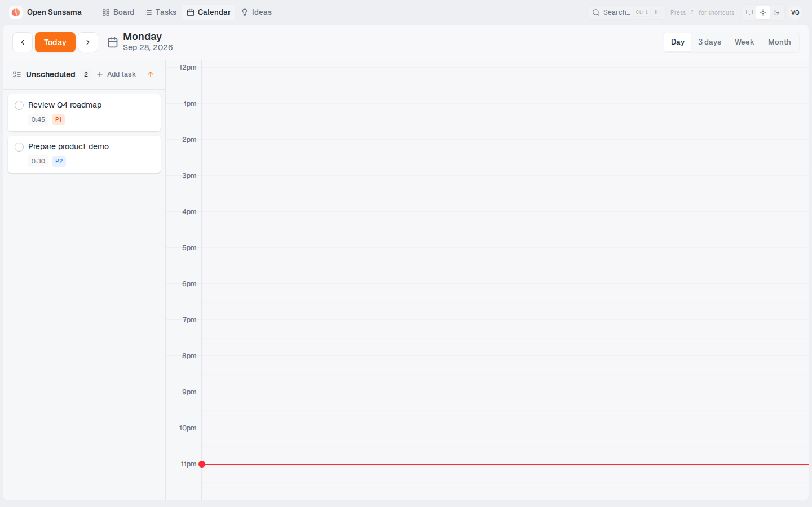
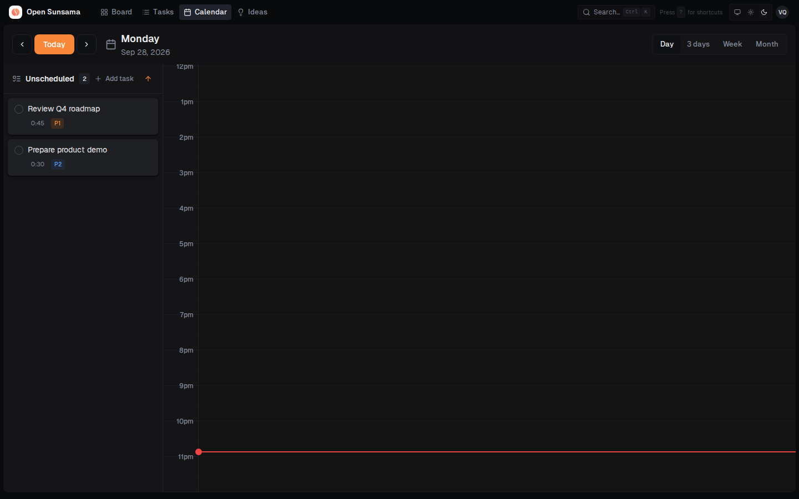
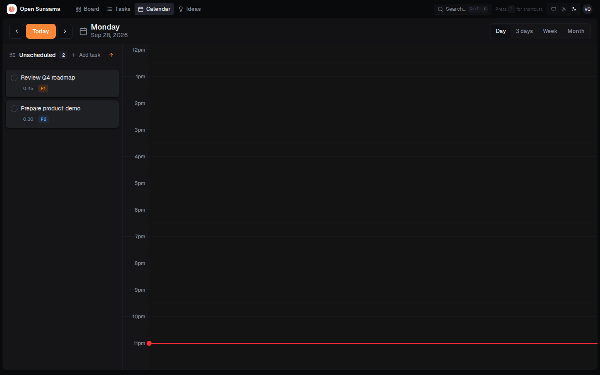
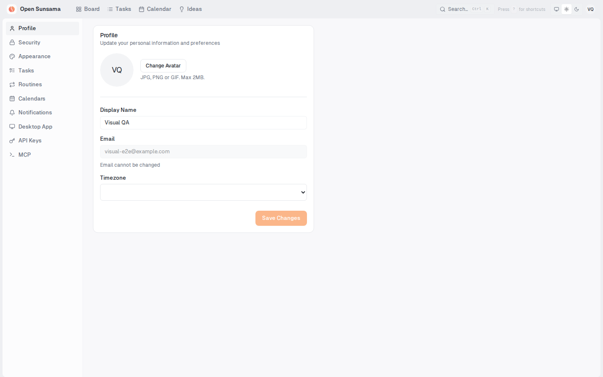
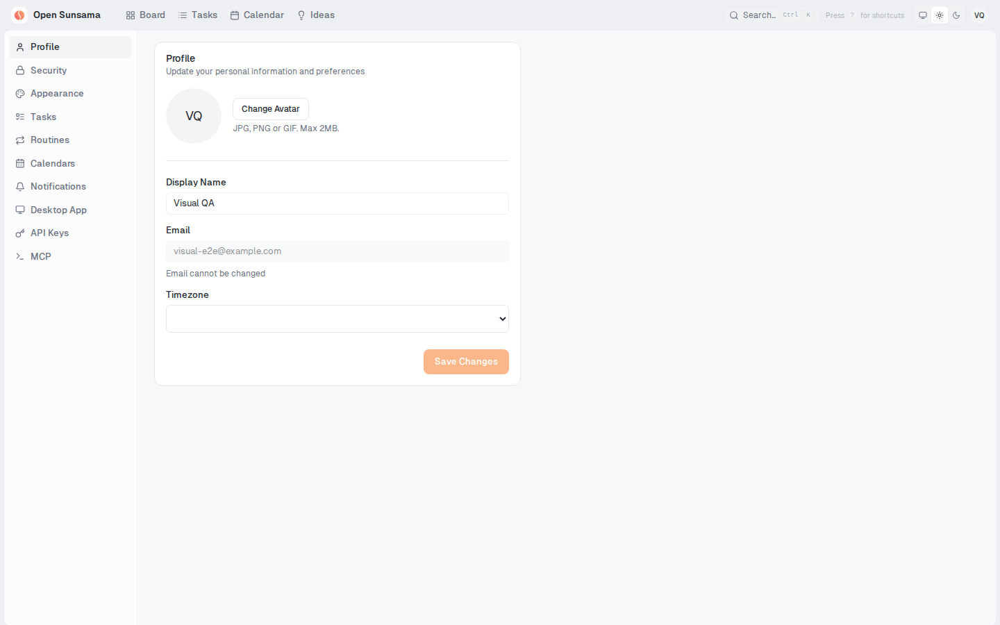
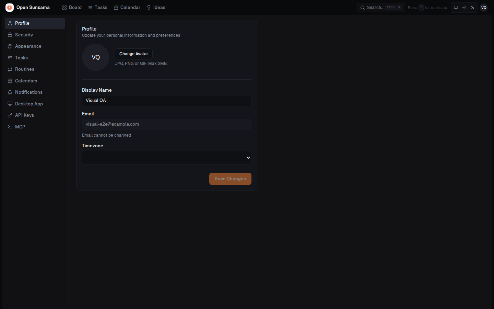
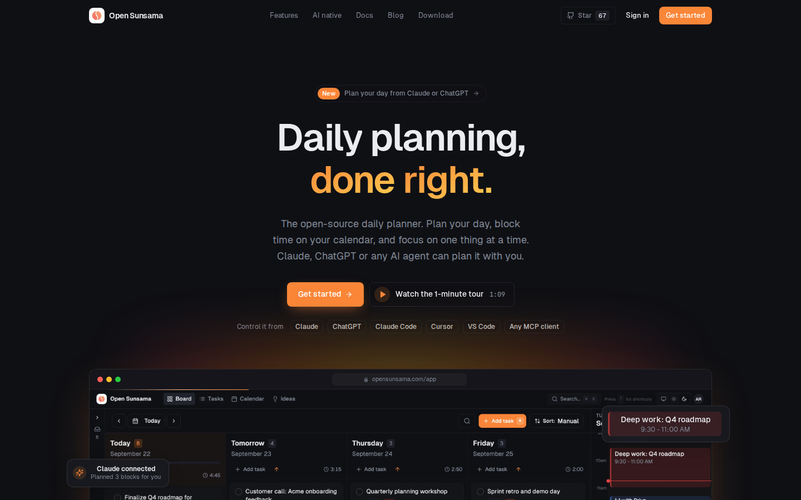

# Tailwind 3 → 4 visual comparison

Captured at 1440 × 900 in Chromium with reduced motion from upstream `main` at `02b72e2` (Tailwind 3) and this branch (Tailwind 4). Both runs used the same mocked user, three dated tasks, one backlog task, and empty calendar events; no live account or database was used. Each column uses the same route, viewport, theme, and data.

| View | Tailwind 3 | Tailwind 4 |
| --- | --- | --- |
| Board · light |  |  |
| Board · dark |  |  |
| Calendar · light |  |  |
| Calendar · dark |  |  |
| Settings · light |  |  |
| Settings · dark |  |  |
| Landing · light |  |  |
| Landing · dark |  |  |

The landing product image animates independently of Tailwind; the still frame may differ slightly between captures. These Chromium comparisons do not replace testing on a macOS 11 machine with Safari 16.4+.
